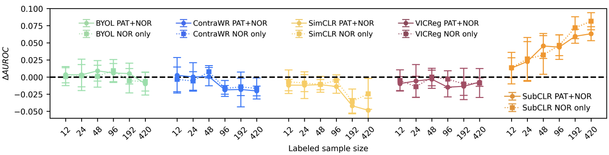
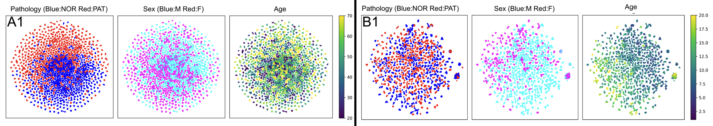

# Self-supervised Learning for Clinical EEG

This repository contains the implementation of our paper "Self-supervised Learning for Encoding Between-Subject Information in Clinical EEG". The code allows for systematic evaluation of self-supervised learning (SSL) methods for pathology detection in EEG data.




Learned representations for neurological (left; TUAB) and psychiatric (right; HBN) datasets.


## Features

- Implementation of multiple SSL approaches:
  - SubCLR (our novel subject-based contrastive learning method)
  - ContraWR (Contrast with World Representation)
  - BYOL (Bootstrap Your Own Latent)
  - VICReg (Variance-Invariance-Covariance Regularization)
  - SimCLR (Simple Contrastive Learning of Representations)
- Support for EEG datasets:
  - TUAB (Temple University Hospital Abnormal EEG Corpus)
  - HBN (Healthy Brain Network)
- Scaling experiments for pretraining sample sizes
- Transfer learning and data fusion experiments
- Baseline comparisons (handcrafted features, Riemannian filterbank, supervised learning)

## Installation

```bash
git clone https://github.com/sami-gijsen/subclr.git
cd subclr
```

### Installing Dependencies

```bash
# Install PyTorch ecosystem with conda (with CUDA support)
conda install pytorch=1.12.1 torchvision=0.13.1 torchaudio=0.12.1 cudatoolkit=11.3 -c pytorch

# Then install the rest with pip
pip install -r requirements.txt
```

Alternatively, for a fresh installation in a new conda environment:

```bash
# Create a new environment
conda create -n subclr python=3.10

# Activate it
conda activate subclr

# Install PyTorch with conda
conda install pytorch=1.12.1 torchvision=0.13.1 torchaudio=0.12.1 cudatoolkit=11.3 -c pytorch

# Install the rest from requirements.txt
pip install -r requirements.txt
```

## Usage

### Data Preprocessing

The repository includes utilities for processing EEG datasets:

`HBN_preprocessing.py` and `TUH_preprocessing.py` are used to preprocess the HBN and TUAB datasets, respectively.
`HBN_utils.py` and `TUH_utils.py` are used to convert the preprocessed data into a format suitable for training.

### Self-supervised Pretraining (with DDP support)

`nohup torchrun --nproc_per_node=1 --master_port 12500 run_DL.py -f config.yaml > ./logs/name.log 2>&1 &!`

(With `setting: [SSL_PRE]` in the config file)

### Linear probing as well as classification with expert-based features

`nohup python run_ML.py -f config.yaml > ./logs/name.log 2>&1 &!`

(With `setting: [SSL_LIN]`, [`HC`], or [`RFB`] in the config file)

## Datasets

### Healthy Brain Network (HBN)
The Healthy Brain Network dataset is a pediatric dataset mainly covering psychiatric disorders. It contains considerable comorbidity, with common disorder categories including ADHD, anxiety disorders, learning disorders, autism spectrum disorders, and depression.

[HBN Dataset Website](https://fcon_1000.projects.nitrc.org/indi/cmi_healthy_brain_network/)

### Temple University Hospital Abnormal EEG Corpus (TUAB)
The TUAB dataset contains clinical EEG data predominantly of adults recorded in a hospital setting. Pathology is largely neurological, including epilepsy, stroke, and Alzheimer's disease, among others.

[TUAB Dataset Website](https://isip.piconepress.com/projects/nedc/html/tuh_eeg/)

## Pretrained Weights

We provide pretrained SubCLR weights for both datasets in the `/pretrained/` directory:
- HBN (trained on 1.1 million crops from 2300 subjects): 5 random weight initializations
- TUAB (trained on 1.2 million crops from 2712 subjects): 5 random weight initializations

These weights can be used for transfer learning experiments or as feature extractors (96 dimensional for 10 seconds of 200Hz single-channel EEG)

## Citation

If you use this code in your research, please cite our paper:

```
@article{gijsen2025self,
  title={Self-supervised Learning for Encoding Between-Subject Information in Clinical EEG},
  author={Gijsen, Sam and Ritter, Kerstin},
  journal={ICLR 2025 Workshop LMRL},
  year={2025}
}
```
